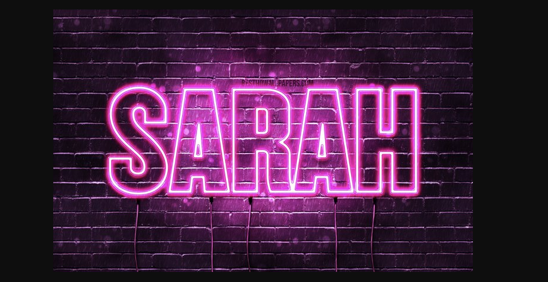
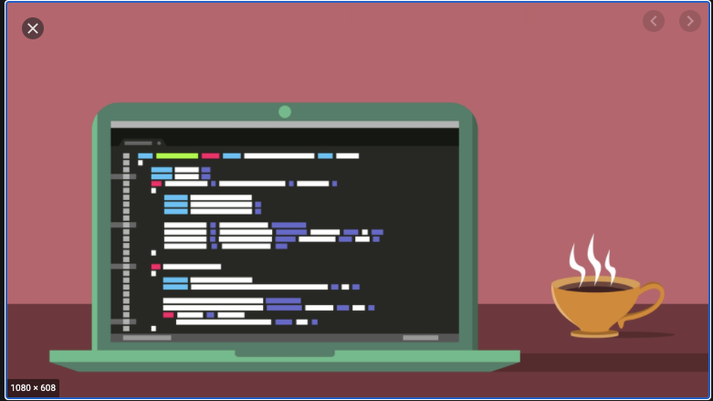

</img>

<h2> All about me: </h2>
      <h4> Hardworking creative coder who loves the outdoors and solving problems. </h4>
      After working as a cosmetoglogist for the past decade, I am a people person who has a passion for code, and learning as much as I can.
      I have a amazing skill of talking and understanding my surroundings and making it creative and learning at the same time.      
      <h4> Creative and innovative problem solver, empathetic team builder, optimist, and communicative collaborator. </h4>

 <h4>
   GitHub Stats:
 </h4>

  

<h3> Tech: </h3>
  - Languages: Javascript, HTML, CSS  
  - Front-End: React, Redux   
  - Testing: Jest, QUnit, Node   
  - Databases: PostgreSQL   
  - Tools: VS Code, Slack, Github,  Heroku, Netlify, Postman, pgAdmin  
  - Dev Dependance: superagent, express, cors, dotenv, node, and etc......  
  

  

 
</img>
